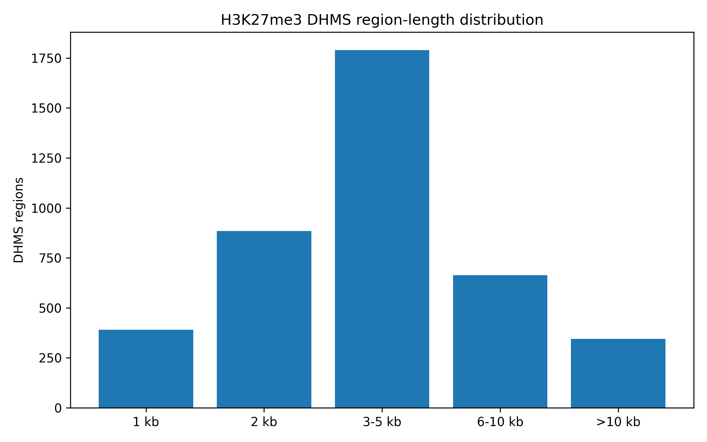
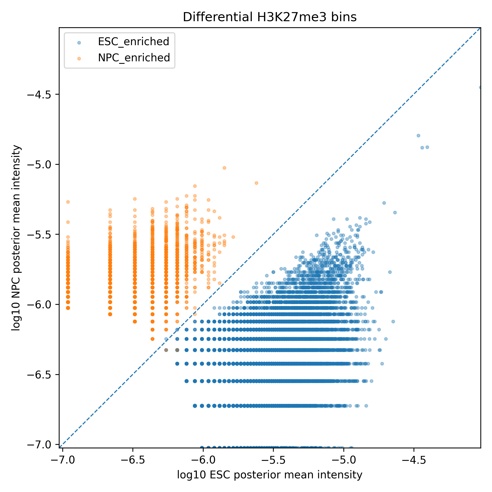
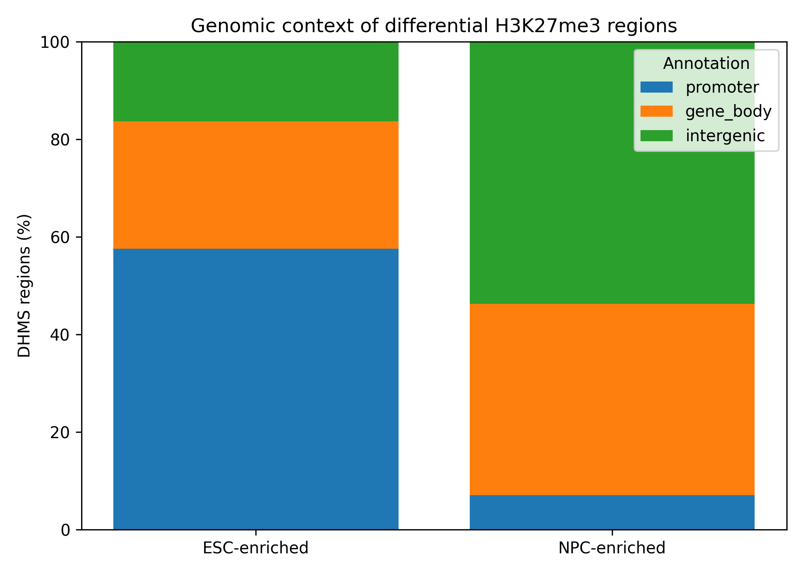

# ChIPDiff Reproduction

Python reproduction of the HMM-based differential histone modification method described in:

> Xu H., Wei C.-L., Lin F., Sung W.-K.  
> **An HMM approach to genome-wide identification of differential histone modification sites from ChIP-seq data.**  
> *Bioinformatics*, 2008.

This project reproduces the H3K27me3 ESC-versus-NPC analysis presented in the original ChIPDiff study. **ChIPDiff** is a computational method that uses a Hidden Markov Model (HMM) to identify differential histone modification sites between two ChIP-seq libraries.

---
## Biological context

**ChIP-seq (Chromatin Immunoprecipitation Sequencing)** is a sequencing-based method used to study the genomic distribution of DNA-associated proteins and histone modifications. 

The histone modification studied here is **H3K27me3** (trimethylation of lysine 27 on histone H3), a chromatin mark generally associated with transcriptional repression.

The  analysis compares H3K27me3 profiles between two mouse cell types:
- **ESC — Embryonic Stem Cells**
- **NPC — Neural Progenitor Cells**

The objective is to identify genomic regions where H3K27me3 enrichment differs between ESC and NPC. These regions are referred to as **Differential Histone Modification Sites (DHMSs)**.

The analysis is performed on the canonical chromosomes of the mouse mm8 genome assembly (`chr1–chr19`, `chrX`, and `chrY`).
---

## ChIPDiff workflow

```text
Raw aligned ChIP-seq reads
        ↓
Deduplication
        ↓
100 bp strand-dependent fragment shift
        ↓
1 kb genomic binning
        ↓
Putative histone modification sites
        ↓
Bayesian intensity estimation
        ↓
HMM emission weights
        ↓
Three-state Hidden Markov Model
        ↓
Forward-backward posterior inference
        ↓
Differential genomic bins
        ↓
DHMS regions
```
---

## Input data and preprocessing

The reproduction uses H3K27me3 ChIP-seq libraries from the Mikkelsen et al. dataset:

- **ESC:** `GSM307619`
- **NPC:** `GSM307614`

Genome assembly:

```text
Mouse mm8
NCBI Build 36
```

Reads mapping to the same genomic position and orientation are deduplicated.

Each read is then shifted by **100 bp according to strand orientation** to approximate the center of the immunoprecipitated DNA fragment.

The genome is divided into **1 kb bins**, and shifted fragments are counted in each bin for both libraries.

The raw sequencing files are used locally but are not included in the GitHub repository because of their size.

Additional metadata used by the project include:

```text
metadata/mm8.chrom.sizes
metadata/mm8.refFlat.txt.gz
```
---

## Putative histone modification sites

Before HMM inference, ChIPDiff filters genomic bins according to their normalized combined ChIP-seq signal.

The filtering accounts for the sequencing depth of both libraries and uses:

```text
η = 0.7
```

as the assumed valid fraction of the genome.

Bins passing the threshold are retained as **putative histone modification sites** and neighboring sites are grouped into regions.

---

## Bayesian intensity estimation

For each genomic bin, histone modification intensity is modeled using a binomial likelihood with a Beta prior.

The prior parameters are:

```text
α = 1
β = m
```

where `m` is the total number of genomic bins.

Posterior intensity distributions are estimated separately for ESC and NPC.

A fold-change threshold of:

```text
τ = 3
```

is used to distinguish three possible states:

```text
ND            = non-differential
ESC-enriched  = higher H3K27me3 enrichment in ESC
NPC-enriched  = higher H3K27me3 enrichment in NPC
```
---

## Hidden Markov Model

For each genomic bin, the posterior intensity distributions are used to compute **emission weights**, which measure how compatible the observed ESC and NPC signals are with each hidden state.

The HMM also models the spatial dependency between neighboring genomic bins using a **first-order Markov assumption**:

```text
Bin 1        Bin 2        Bin 3        Bin 4
  |            |            |            |
 ESC     →     ESC     →     ESC     →      ND
```

This is useful because histone modifications often extend across consecutive genomic regions.

Transitions between states are represented by a **transition matrix**.

Following the original study, the transition matrix is initialized uniformly and trained on **10,000 randomly selected putative histone modification regions** using the **Baum-Welch algorithm**.

After training, the **forward-backward algorithm** is used to calculate the posterior probability of each hidden state.

A genomic bin is called differential when the posterior probability of an enriched state exceeds:

```text
ρ = 0.95
```

Consecutive differential bins are then merged into DHMS regions.

---

## Main parameters

| Parameter | Value |
|---|---:|
| Genomic bin size | 1000 bp |
| Fragment shift | 100 bp |
| Fold-change threshold `τ` | 3 |
| Posterior threshold `ρ` | 0.95 |
| Valid genome fraction `η` | 0.7 |
| HMM training regions | 10,000 |

---

## Reproduction results

| Result | Published | Reproduction |
|---|---:|---:|
| Differential bins | 26,230 | 19,777 |
| DHMS regions | 4,722 | 4,073 |
| ESC-enriched regions | 3,833 | 3,589 |
| NPC-enriched regions | 889 | 484 |

The preprocessing, Bayesian intensity estimation and emission stages closely reproduce the expected intermediate calculations. The final HMM calls remain below the values reported in the original publication.
---

## Exploratory genomic annotation

As an additional downstream analysis, reproduced DHMS regions were annotated using UCSC RefSeq annotations for the mm8 mouse genome.

When multiple transcripts correspond to the same gene, the transcript with the **longest coding region** is retained.

Promoters are defined as:

```text
TSS ± 1 kb
```

Each DHMS region is classified as:

- **promoter**
- **gene body**
- **intergenic**

The annotation also reports the nearest gene and the distance from the DHMS region center to the nearest transcription start site.
---

## Figures

### DHMS region-length distribution



### ESC versus NPC H3K27me3 intensity



### Genomic annotation



---

## Repository structure

```text
chipdiff-reproduction/
├── LICENSE
├── README.md
├── data/
├── docs/
│   └── paper_notes.md
├── metadata/
│   ├── GSE12241_README.aligned.txt
│   ├── mm8.chrom.sizes
│   └── mm8.refFlat.txt.gz
├── notebooks/
│   └── 01_exploratory.ipynb
├── requirements.txt
├── results/
│   ├── figures/
│   └── tables/
├── scripts/
│   ├── annotate_regions.py
│   ├── make_figures.py
│   └── run_chipdiff.py
└── src/
    └── chipdiff/
        ├── __init__.py
        ├── emissions.py
        ├── filtering.py
        ├── hmm.py
        ├── intensity.py
        ├── pipeline.py
        ├── preprocessing.py
        └── results.py
```

The notebook contains exploratory analyses and intermediate inspection, while the reproducible implementation is contained in `src/` and `scripts/`.

---

## Running the analysis

Install dependencies:

```bash
pip install -r requirements.txt
```

Run the ChIPDiff pipeline:

```bash
python3 scripts/run_chipdiff.py
```

Annotate DHMS regions:

```bash
python3 scripts/annotate_regions.py
```

Generate figures:

```bash
python3 scripts/make_figures.py
```
---

## Main outputs

```text
results/tables/dhms_bins.csv
results/tables/dhms_regions.csv
results/tables/dhms_regions_annotated.csv
```

- `dhms_bins.csv` — differential 1 kb bins identified by the HMM
- `dhms_regions.csv` — consecutive differential bins merged into regions
- `dhms_regions_annotated.csv` — RefSeq annotation of the reproduced regions

---

## Reproducibility notes

Some implementation details of the original method are not fully specified in the publication.

The objective of this project is therefore to reproduce the published computational workflow as closely as possible without tuning the method to force exact numerical agreement.

---

## Reference

Xu H, Wei C-L, Lin F, Sung W-K.  
**An HMM approach to genome-wide identification of differential histone modification sites from ChIP-seq data.**  
*Bioinformatics*. 2008;24(20):2344–2349.  
doi:10.1093/bioinformatics/btn402

## License

The original code in this repository is available under the [MIT License](LICENSE).

External datasets, genome annotations and publications used in this project remain subject to their respective original licenses and terms of use.